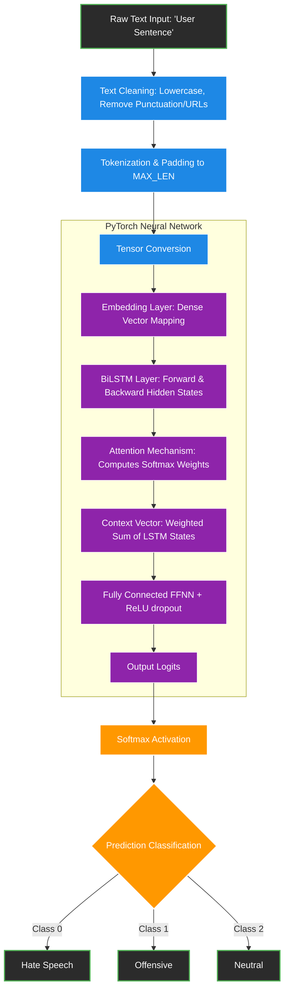

# College Project Report Materials: Hate Speech Detection

Here are the written components for your NNDL Project Report. You can copy and paste these directly into your final PDF, Word Document, or PowerPoint presentation.

---

## 1. System Architecture Diagram
*Copy the code below into a Mermaid renderer (like the one built into Notion, GitHub, or https://mermaid.live) to generate your logic flow diagram.*

---

## 2. Theory Section: Why BiLSTM + Attention?

**1. The Problem with Standard NLP Models**
Traditional Feed-Forward Neural Networks (FFNNs) evaluate text by looking at individual words in isolation (Bag of Words), entirely ignoring sequence and context. While Recurrent Neural Networks (RNNs) process sequences, they suffer from the **Vanishing Gradient Problem**, meaning they 'forget' words that appeared early in a long tweet or sentence. 

**2. Long Short-Term Memory (LSTM) Networks**
To resolve vanishing gradients, we implemented an LSTM. LSTMs utilize a persistent "Cell State" alongside specialized gates (Forget, Input, Output) computed via Sigmoid activations ($ \sigma $). These gates decide what contextual information to mathematically preserve and what to discard, allowing the network to retain critical context over long text sequences.

**3. The Importance of Bidirectionality (BiLSTM)**
Language is deeply contextual. The sentiment of a word often depends on the words that come *after* it, not just before it. A standard LSTM only reads left-to-right. A **BiLSTM** deploys two distinct LSTM layers: one reading forwards and one reading backwards. 
*   *Example:* "I am **not** a terrible person."
*   A forward-only LSTM might process "not", then "a", then see "terrible" and predict toxicity. A BiLSTM combines the backward pass ("person terrible a not"), allowing the hidden state of "terrible" to inherently know it is directly negated by "not". 

**4. The Attention Mechanism**
Hate speech is often determined by just 1 or 2 specific toxic words, heavily buried in 20+ words of harmless text. Treating every word's LSTM output equally dilutes the network's understanding. 
We introduced a custom **Attention Mechanism** to mimic human reading:
$$\text{Attention Score}_i = W \cdot \text{tanh}(V \cdot h_i)$$
$$\alpha_i = \text{Softmax}(\text{Attention Score}_i)$$
$$\text{Context Context Vector} = \sum_{i=1}^{T} \alpha_i h_i$$
The Attention sub-network calculates an attention weight ($\alpha_i$) for every word's hidden state ($h_i$). A Softmax activation ensures these weights sum to 1.0. We then multiply the LSTM outputs by these weights. This mathematically scales up the numeric value of toxic "trigger" words and scales down irrelevant words (like "the", "and") before sending the vectors to the final Fully Connected classification layer.